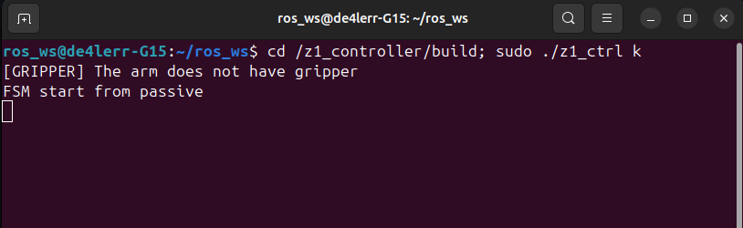

# B2-Z1 ROS2
Este repositório tem por objetivo facilitar o desenvolvimento de aplicações envolvendo o robô quadrupede B2 da Unitree com o braço robótico Z1 montado em cima dele. 
Explicação de cada diretório:
- **ubuntu_2004:** Repositório voltado para desenvolvimento em ROS Noetic.
- **ubuntu_2204:** Repositório voltado para desenvolvimento em ROS2 Humble.
- **ros_ws_shrd:** Repositório compartilhado entre os dois containers.

> ### Nota
> Os projetos desenvolvidos até então dentro deste repositório foram realizados dentro do ubuntu_2204 em ROS2 Humble usando sdks e outras interfaces disponibilizadas pelas Unitree, a presença do ubuntu_2004 se deve ao fato de projetos passados terem sido desenvolvidos em cima do ROS Noetic.

Cada diretório com prefixo “ubuntu” possui um arquivo localizado em docker/scripts para instalação e inicialização do container.
- - -
## Instruções iniciais  
1. Conecte o cabo ethernet à porta principal do Z1 (porta do lado esquerdo);
2. Ligue o sistema (iniciando o B2);
3. Espere o B2 se levantar;
4. Verifique se a conexão foi estabelecida;

	

5. Mude as configurações da conexão de acordo com a imagem abaixo e aplique as mudanças.
	
 
 
Isso permitirá que seu computador se comunique com o sistema da Unitree (o endereço 192.168.123.XXX pode ter quaisquer valores no lugar dos X, a não ser o valor 110, que é usado pelo Z1, e os valores 161, 162, 163 e 164, que são usados pelo B2);

6. Com o container _ubuntu_2204_ no ar, copie e cole este comando no terminal:

```Bash
cd /z1_controller/build; sudo ./z1_ctrl k
```

Isso iniciará o controle do braço pelo pelo teclado, e uma mensagem como esta deve aparecer:


 
Então encerre o programa com `ctrl + c`;
7. Retire o cabo ethernet ligado ao seu computador da porta principal do B2;
8. Conecte o cabo ethernet que sai do B2 ao Z1;
9. Conecte o outro cabo ethernet que sai do B2 ao seu computador;
10. Tente executar novamente o comando do passo 6;
11. Se funcionar, está tudo pronto para o desenvolvimento.
- - -
## Desenvolvimento usando ubuntu_2204
Algumas interfaces são instaladas na raiz do container:
- b2_sdk2 → SDK do B2 voltada para o desenvolvimento de aplicações em CPP;
- b2_sdk2_python → SDK do B2 voltada para o desenvolvimento de aplicações em python;
- z1_sdk → SDK voltada para o desenvolvimento de aplicações usando o Z1 em CPP;
- z1_controller → Interface usada para se comunicação e controle com o Z1.
Na pasta ros_ws:
- b2_ws → Desenvolvimento em ROS2 para o B2 e Z1;
- unitree_ros2 → Interface entre o B2 e ROS2


